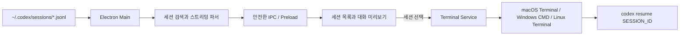

# Codex Session Manager

`~/.codex/sessions`에 저장된 Codex CLI 세션을 찾아 대화 내용을 미리 보고, 선택한 세션을 새 터미널에서 이어서 사용할 수 있는 데스크톱 애플리케이션입니다.

macOS와 Windows에서 동일한 화면과 기능을 제공하며 Linux 터미널도 기본 지원합니다. 모든 세션 처리는 로컬 컴퓨터에서 이루어집니다.

## 목차

- [주요 기능](#주요-기능)
- [1.1.0 보완 사항](#110-보완-사항)
- [동작 구조](#동작-구조)
- [요구 사항](#요구-사항)
- [실행 방법](#실행-방법)
- [화면 사용법](#화면-사용법)
- [키보드 조작](#키보드-조작)
- [대용량 세션 목록 처리](#대용량-세션-목록-처리)
- [세션 재개 방식](#세션-재개-방식)
- [설정과 환경 변수](#설정과-환경-변수)
- [테스트와 검증](#테스트와-검증)
- [설치 파일 만들기](#설치-파일-만들기)
- [프로젝트 구조](#프로젝트-구조)
- [문제 해결](#문제-해결)
- [데이터와 보안](#데이터와-보안)
- [알려진 제한 사항](#알려진-제한-사항)

## 주요 기능

- 로컬 Codex 세션 JSONL 파일 자동 검색
- 첫 사용자 메시지를 이용한 세션 제목과 최근 대화 미리보기
- 작업 경로, 생성일, 최근 활동일, 메시지 수 및 세션 ID 표시
- 제목, 대화, 작업 경로와 세션 ID 통합 검색
- 최근 활동 또는 생성일 기준 정렬
- 세션 전체 대화 미리보기
- 대용량 목록을 위한 독립 스크롤과 80개 단위 점진 렌더링
- 변경되지 않은 세션의 재분석을 생략하는 파일 캐시
- 방향키, Page Up/Down, Home/End를 이용한 빠른 이동
- 선택한 세션을 `codex resume <SESSION_ID>`로 새 터미널에서 재개
- `CODEX_HOME`과 `CODEX_PATH` 환경 변수 지원
- 다른 세션 폴더를 직접 선택하고 다음 실행에도 유지하는 기능

## 1.1.0 보완 사항

- 목록 미리보기뿐 아니라 최대 12,000자의 최근 대화 검색 인덱스를 추가했습니다.
- 세션 상세 대화도 파일 크기와 수정 시각 기준으로 캐시해 재선택 속도를 개선하고, 최근 20개만 유지하도록 제한했습니다.
- `.codex` 루트 폴더를 선택하면 내부 `sessions` 폴더를 자동으로 인식합니다.
- 사용자 지정 폴더를 표준 Codex 세션 경로로 되돌리는 **기본 경로** 버튼을 추가했습니다.
- 메타데이터에 ID가 없을 때 파일 이름에서 정확한 UUID를 추출합니다.
- 터미널 실행 전 세션 ID를 완전한 UUID 형식으로 검증합니다.
- 외부 창 열기, 외부 URL 이동과 웹 권한 요청을 Electron 메인 프로세스에서 차단합니다.
- 손상된 JSONL, 존재하지 않는 폴더, 긴 대화, 캐시 갱신과 경로 자동 인식 테스트를 추가했습니다.

## 동작 구조



Electron 메인 프로세스만 로컬 파일 시스템과 운영체제 터미널에 접근합니다. 화면을 담당하는 렌더러 프로세스는 `preload.js`에서 공개한 제한된 API만 사용합니다.

### 세션 파일에서 읽는 정보

Codex 세션은 기본적으로 날짜별 하위 디렉토리의 JSONL 파일로 저장됩니다. 앱은 파일을 한 줄씩 읽으면서 다음 정보만 추출합니다.

| JSONL 정보 | 앱에서 사용하는 용도 |
| --- | --- |
| `session_meta.id` 또는 `session_id` | 세션 식별과 `codex resume` 실행 |
| `session_meta.cwd` | 프로젝트 경로 표시와 터미널 시작 위치 |
| `session_meta.timestamp` | 세션 생성일 |
| `event_msg.user_message` | 세션 제목과 사용자 대화 |
| `event_msg.agent_message` | Codex 답변과 최근 대화 미리보기 |
| 파일 수정 시각 | 최근 활동 정렬과 캐시 갱신 |

시스템 지침, 추론 데이터, 도구 호출과 도구 출력은 대화 미리보기에 포함하지 않습니다. 손상되었거나 아직 작성 중인 불완전한 JSONL 한 줄은 건너뛰고 나머지 기록을 계속 읽습니다.

## 요구 사항

- Node.js 22.12 이상
- npm
- Codex CLI 설치 및 로그인

터미널에서 다음 명령이 정상적으로 실행되어야 합니다.

```bash
codex --version
```

Codex CLI가 기본 위치에 없다면 `CODEX_PATH`에 실행 파일의 전체 경로를 지정할 수 있습니다. 세션 저장 위치를 변경한 경우에는 `CODEX_HOME`을 설정하거나 앱의 **세션 폴더** 버튼을 이용하세요.

## 실행 방법

### macOS와 Linux

```bash
cd session-manager
npm install
npm start
```

### Windows PowerShell

```powershell
cd session-manager
npm install
npm start
```

실행 후 왼쪽 목록에서 세션을 선택하면 오른쪽에 대화가 표시됩니다. **터미널에서 이어하기**를 누르거나 `Enter`를 누르면 새 터미널 창에서 해당 세션이 열립니다.

## 화면 사용법

| 영역 | 기능 |
| --- | --- |
| 왼쪽 상단 | 검색된 전체 세션 수와 현재 운영체제 표시 |
| 검색창 | 제목, 최근 대화, 프로젝트 경로 또는 세션 ID 검색 |
| 정렬 버튼 | 최근 활동 또는 최초 생성일 순서로 정렬 |
| 세션 카드 | 프로젝트 이름, 날짜, 제목, 최근 대화와 메시지 수 표시 |
| 오른쪽 헤더 | 선택한 세션의 제목, 최근 활동일과 전체 메시지 수 표시 |
| 작업 경로 | 세션이 생성된 프로젝트 디렉토리 표시 |
| 세션 ID | 클릭하여 클립보드에 복사 |
| 대화 영역 | 사용자와 Codex 메시지를 시간 순서로 표시 |
| 터미널에서 이어하기 | 선택한 세션을 새 터미널에서 재개 |

상단의 **세션 폴더** 버튼을 누르면 표준 경로가 아닌 다른 세션 디렉토리를 선택할 수 있습니다. 선택한 경로는 앱 설정에 저장되어 다음 실행에도 유지됩니다.

## 키보드 조작

| 키 | 기능 |
| --- | --- |
| `↑` / `↓` | 이전 또는 다음 세션 선택 |
| `Page Up` / `Page Down` | 8개 단위로 이동 |
| `Home` / `End` | 첫 번째 또는 마지막 세션으로 이동 |
| `Enter` | 선택한 세션을 새 터미널에서 재개 |
| `/` | 검색창으로 이동 |
| `Escape` | 검색어를 지우고 검색창에서 나오기 |
| `R` | 세션 목록 새로고침 |

마우스 휠이나 항상 표시되는 스크롤바로도 목록을 이동할 수 있습니다. 목록 끝에 가까워지면 다음 세션 묶음을 자동으로 표시합니다.

## 대용량 세션 목록 처리

- 왼쪽 목록은 창 높이에 맞춰 고정된 독립 스크롤 영역입니다.
- 최초에는 80개 카드만 렌더링해 앱이 빠르게 반응하도록 합니다.
- 목록 하단에서 다음 80개를 자동으로 추가하며 **다음 항목 보기** 버튼도 제공합니다.
- 키보드로 아직 표시되지 않은 항목을 선택하면 필요한 범위까지 자동으로 렌더링합니다.
- 세션을 선택해도 기존 목록의 스크롤 위치가 유지됩니다.
- 파일 크기와 수정 시각이 변하지 않은 세션은 새로고침할 때 다시 분석하지 않습니다.
- 상세 대화도 파일이 변경되지 않았다면 캐시 결과를 재사용하며 최근 20개 세션만 메모리에 유지합니다.
- 검색용 텍스트는 세션당 최근 12,000자로 제한하고, 최초 요청은 별도 제목으로 항상 검색합니다.
- 하나의 세션이 매우 길면 최근 500개 메시지만 화면에 표시하고 안내 문구를 보여줍니다.
- 개별 메시지는 최대 20,000자까지 표시해 비정상적으로 큰 기록이 화면을 멈추게 하는 상황을 줄입니다.

개발 검증에서는 240개 세션을 사용해 80개 단위 추가 렌더링, 스크롤 위치 유지 및 `End` 키를 이용한 마지막 세션 선택을 확인했습니다.

## 세션 재개 방식

선택한 세션은 공식 Codex CLI 형식에 따라 다음 명령으로 재개합니다.

```bash
codex resume <SESSION_ID>
```

앱은 세션 ID가 UUID 형태인지 확인합니다. 세션에 저장된 작업 경로가 현재 컴퓨터에 존재하면 그 위치에서 새 터미널을 시작합니다.

| 운영체제 | 실행 방식 |
| --- | --- |
| macOS | Apple 기본 Terminal을 활성화하고 새 셸에서 Codex 실행 |
| Windows | 독립된 명령 프롬프트 창에서 Codex 실행 |
| Linux | `x-terminal-emulator`, GNOME Terminal, Konsole 순서로 탐색 |

세션에 저장된 프로젝트 경로가 더 이상 존재하지 않으면 사용자 홈 디렉토리에서 실행합니다. Codex 설정의 `tui.resume_cwd` 값에 따라 Codex가 사용할 작업 디렉토리를 다시 물어볼 수 있습니다.

자세한 CLI 옵션은 [Codex CLI `resume` 명령 문서](https://learn.chatgpt.com/docs/developer-commands?surface=cli#cli-codex-resume)를 참고하세요.

## 설정과 환경 변수

앱은 다음 순서로 세션 위치를 결정합니다.

1. 앱에서 직접 선택해 설정 파일에 저장된 폴더
2. `CODEX_HOME/sessions`
3. 사용자 홈 디렉토리의 `.codex/sessions`

| 변수 | 기본값 | 설명 |
| --- | --- | --- |
| `CODEX_HOME` | `~/.codex` | Codex 설정, 인증, 로그와 세션이 저장되는 루트 경로 |
| `CODEX_PATH` | 자동 탐색 | 앱에서 실행할 Codex CLI 실행 파일의 절대 경로 |

Codex CLI는 macOS/Linux에서 `~/.local/bin`, `~/.npm-global/bin`, Homebrew 경로와 시스템 경로를 확인합니다. Windows에서는 `%APPDATA%\npm\codex.cmd` 등 일반적인 설치 위치를 확인한 뒤 `PATH`를 검색합니다.

사용자가 선택한 세션 폴더는 Electron의 사용자 데이터 디렉토리에 있는 `settings.json`에 저장됩니다. 대화 내용이나 인증 정보는 이 설정 파일에 복사하지 않습니다.

## 테스트와 검증

```bash
npm test
```

테스트는 JSONL 파싱, 세션 정렬, 대화 추출, 환경 컨텍스트 제거 및 세션 ID 명령어 안전성을 확인합니다.

현재 검증 결과:

- Node.js 문법 검사 통과
- 단위 테스트 11개 통과
- npm 의존성 보안 감사 취약점 0개
- 실제 `~/.codex/sessions` 세션 목록과 대화 렌더링 확인
- 240개 세션 목록의 점진 렌더링과 키보드 탐색 확인
- Apple Silicon macOS DMG 및 ZIP 패키징 확인

## 설치 파일 만들기

현재 운영체제용 설치 파일:

```bash
npm run dist
```

Intel 및 Apple Silicon macOS용 DMG와 ZIP:

```bash
npm run dist:mac
```

64비트 Windows용 NSIS 설치 파일과 포터블 실행 파일:

```bash
npm run dist:win
```

결과물은 `release/` 폴더에 생성됩니다. macOS 설치 파일은 macOS에서, Windows 설치 파일은 Windows에서 빌드해야 합니다. 다른 운영체제에서 앱 본체까지 패키징되더라도 설치기 생성 도구가 실행되지 않을 수 있습니다.

### 생성되는 패키지

| 운영체제 | 형식 | 용도 |
| --- | --- | --- |
| macOS Intel / Apple Silicon | `.dmg` | 일반 설치 이미지 |
| macOS Intel / Apple Silicon | `.zip` | 압축 배포본 |
| Windows x64 | NSIS `.exe` | 설치 위치를 선택할 수 있는 설치 프로그램 |
| Windows x64 | Portable `.exe` | 별도 설치 없이 실행하는 포터블 버전 |

배포 시 운영체제의 보안 경고를 방지하려면 Apple 코드 서명/공증 및 Windows 코드 서명 인증서가 필요합니다.

## 프로젝트 구조

```text
session-manager/
├── src/
│   ├── main.js              # Electron 창, 설정과 IPC
│   ├── preload.js           # 렌더러에 공개하는 제한된 API
│   ├── session-service.js   # JSONL 검색, 캐시와 대화 파싱
│   ├── terminal-service.js  # 운영체제별 Codex 재개
│   ├── index.html           # 애플리케이션 화면
│   ├── styles.css           # UI와 스크롤 스타일
│   └── renderer.js          # 목록, 검색 및 키보드 탐색
├── test/
│   └── session-service.test.js
├── package.json
└── package-lock.json
```

### 주요 IPC API

| API | 역할 |
| --- | --- |
| `sessions:list` | 세션 디렉토리를 검색하고 안전한 목록 데이터 반환 |
| `sessions:detail` | 등록된 세션 ID의 대화 내용 반환 |
| `sessions:resume` | 등록된 세션 ID를 운영체제 터미널에서 재개 |
| `sessions:choose-folder` | 사용자가 세션 폴더를 선택하도록 시스템 대화상자 표시 |
| `app:info` | 세션 경로, Codex CLI 상태와 운영체제 정보 반환 |
| `clipboard:write` | 세션 ID를 시스템 클립보드에 복사 |

렌더러가 임의 파일 경로나 명령어를 전달하지 못하도록 상세 조회와 재개 요청은 메인 프로세스가 미리 만든 세션 인덱스의 ID만 허용합니다.

## 문제 해결

### 세션 목록이 비어 있는 경우

1. `~/.codex/sessions` 폴더가 존재하는지 확인합니다.
2. Codex CLI에서 최소 한 번 대화를 시작했는지 확인합니다.
3. `CODEX_HOME`을 별도로 설정했다면 앱도 같은 환경 변수를 사용해 실행합니다.
4. 앱의 **세션 폴더** 버튼으로 실제 `sessions` 폴더를 직접 선택합니다.
5. `R` 또는 오른쪽 위 새로고침 버튼을 누릅니다.

### Codex CLI를 찾을 수 없다고 표시되는 경우

터미널에서 `codex --version`이 정상적으로 동작하는지 확인하세요. 동작하지 않으면 Codex CLI를 먼저 설치하거나 로그인해야 합니다.

터미널에서는 동작하지만 앱에서 찾지 못하면 `CODEX_PATH`를 전체 실행 파일 경로로 설정하고 앱을 다시 실행하세요.

macOS 예시:

```bash
CODEX_PATH="$HOME/.local/bin/codex" npm start
```

Windows PowerShell 예시:

```powershell
$env:CODEX_PATH="$env:APPDATA\npm\codex.cmd"
npm start
```

### 세션 재개 시 작업 폴더 선택이 표시되는 경우

현재 경로와 세션에 저장된 경로가 다르면 Codex CLI가 사용할 디렉토리를 물을 수 있습니다. Codex의 `tui.resume_cwd` 설정을 `current` 또는 `session`으로 지정하면 이후 기본 동작을 정할 수 있습니다.

### macOS에서 설치 앱이 차단되는 경우

개발용으로 생성한 앱은 Apple Developer ID 서명과 공증이 없으므로 Gatekeeper 경고가 표시될 수 있습니다. 배포용 앱은 유효한 인증서로 서명하고 공증해야 합니다. 로컬 개발 시에는 `npm start`로 실행하는 것이 가장 간단합니다.

### Windows 설치 파일을 macOS에서 만들 수 없는 경우

Windows 앱 본체는 다른 운영체제에서도 패키징될 수 있지만 NSIS 설치기 생성 도구가 호스트에서 실행되지 않을 수 있습니다. Windows 환경에서 `npm run dist:win`을 실행하세요.

### 새 세션이 목록에 바로 나타나지 않는 경우

앱은 세션 폴더를 자동으로 변경하지 않습니다. `R` 키 또는 오른쪽 위 새로고침 버튼으로 목록을 다시 읽으세요. 변경된 파일은 캐시에서 자동으로 무효화되어 최신 내용으로 갱신됩니다.

## 데이터와 보안

- 세션 파일은 읽기 전용으로 사용하며 수정하거나 삭제하지 않습니다.
- Electron의 `contextIsolation`과 렌더러 샌드박스를 활성화합니다.
- 렌더러에는 임의 파일 시스템 또는 Node.js 접근 권한을 제공하지 않습니다.
- 화면에는 사용자와 Codex의 대화 이벤트만 전달하며 시스템 지침과 도구 출력은 제외합니다.
- 재개할 세션 ID는 UUID 형식으로 검증한 뒤 터미널 명령에 전달합니다.
- 대화 문자열은 HTML로 삽입하지 않고 `textContent`로 표시합니다.
- 콘텐츠 보안 정책은 로컬 스크립트, 스타일과 데이터 이미지만 허용합니다.
- 앱 내부에서 외부 URL로 이동하거나 새 창을 여는 요청과 브라우저 권한 요청을 차단합니다.
- 대화 내용은 외부 서버로 전송하지 않습니다.

## 알려진 제한 사항

- 앱은 현재 로컬 Codex CLI JSONL 세션만 표시합니다. Codex 클라우드 작업 목록을 동기화하지 않습니다.
- 세션 기록 형식이 향후 크게 변경되면 파서 업데이트가 필요할 수 있습니다.
- 렌더러는 Markdown을 HTML로 변환하지 않고 원문 텍스트로 안전하게 표시합니다.
- 삭제, 이름 변경, 아카이브와 세션 편집 기능은 제공하지 않습니다.
- 앱 자체 업데이트 기능과 배포용 코드 서명은 포함되어 있지 않습니다.
- Windows 설치 프로그램은 Windows 환경에서 최종 빌드와 실행 검증이 필요합니다.
